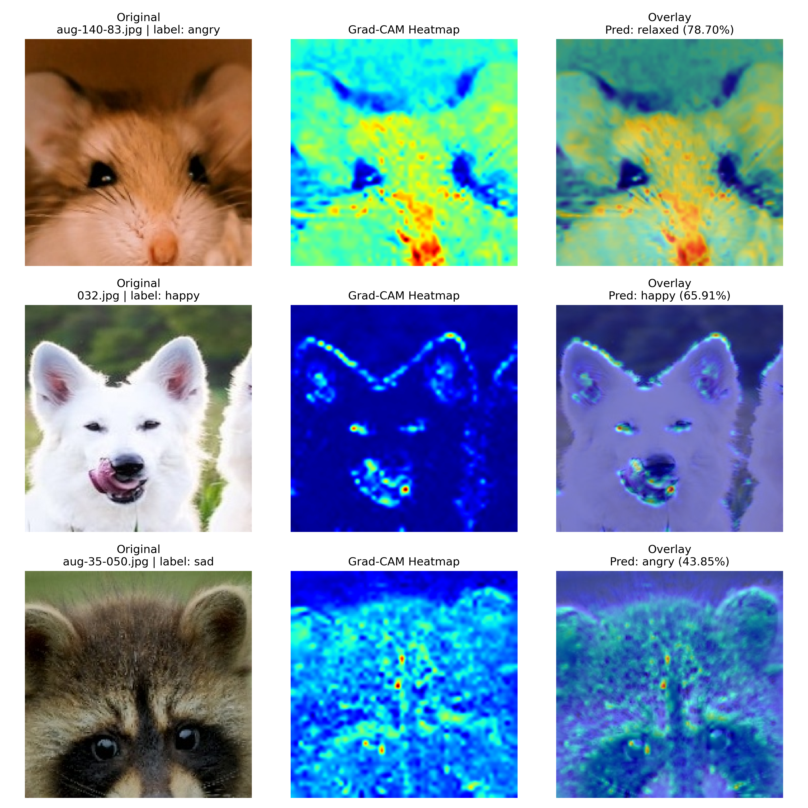

# Dog Emotion Classification with SwinV2

A lightweight, end-to-end pipeline for recognising **four canine emotions** – `angry`, `happy`, `relaxed`, and `sad` – from single RGB images.
The model is built on top of the [`microsoft/swinv2-base-patch4-window12-192-22k`](https://huggingface.co/microsoft) checkpoint and fine-tunes only the *last encoder stage* and *classifier head* for efficiency.

* [Microsoft SwinV2](https://arxiv.org/abs/2111.09883) backbone via **Hugging Face Transformers**.
* **pytorch-grad-cam** for visual explanations.
* Original dog emotion dataset courtesy of the project authors.
* We use [uv](https://github.com/astral-sh/uv) to manage dependencies.

---

## 1. Project Layout

```
dog-emotion-classification-swinv2/
├── train_swinv2.py              # training & validation
├── evaluate_swinv2.py           # zero-shot / fine-tuned evaluation
├── visualize_gradcam.py         # Grad-CAM visualisation
├── models/                      # checkpoints (saved automatically)
├── results_gradcam/             # evaluation & visual outputs
├── pyproject.toml               # dependency specification
└── README.md                    # you are here
```
GPU acceleration is supported on **CUDA**, **MPS** (Apple Silicon), or CPU fallback.

### Dataset Structure
The code expects **folder-per-class** organisation:
We use [Dog Emotion dataset from Kaggle](https://www.kaggle.com/datasets/danielshanbalico/dog-emotion) as the main dataset (with folders `angry`, `happy`, `relaxed`, `sad`).

Every sub-directory holds `.jpg` / `.png` images.  An 80 / 10 / 10 split is created **on-the-fly** for train/val/test.

An auxiliary [*Pet* dataset](https://www.kaggle.com/datasets/anshtanwar/pets-facial-expression-dataset) (with folders `Angry`, `happy`, `Other`, `Sad`) can be evaluated via `evaluate_swinv2.py`. We mapped Other to relaxed for consistency. Note that the Pet dataset contains various animals, not just dogs.

---

## 3. Training

```
python train_swinv2.py \
  --root DogEmotion            # dataset root (see above) (default: DogEmotion)
  --batch 32                   # batch size (default: 32)
  --epochs 12                  # training epochs (default: 12)
  --lr 3e-5                    # base learning-rate (AdamW) (default: 3e-5)
  --out models                 # checkpoint output directory (default: models)
  --model microsoft/swinv2-base-patch4-window12-192-22k
```

During training the script prints epoch-level metrics and automatically stores the **best** model (highest macro-F1 on validation) at:

When the training is finished, the best model is saved in `models/best_swin_<timestamp>_epoch##_f1#.####.pt` and we evaluate the model on the test set.

---

## 4. Evaluation & Inference

`train_swinv2.py` evaluates the current best checkpoint **after every epoch**, reporting:
`Accuracy`, `Macro-F1`, `Precision`, `Recall`, `Balanced Accuracy`, and `Top-2 Accuracy`.

### 4.1 On external *Pet* dataset
```
python evaluate_swinv2.py 
  --ckpt models/best_swin_<timestamp>_epoch##_f1#.####.pt 
  --root ../Pet        # Pet dataset root
  --include_other      # treat 'Other' as class 'relaxed'
```

---

## 5. Visualisation with Grad-CAM


```
python visualize_gradcam.py \
  --ckpt models/best_swin_<timestamp>_epoch##_f1#.####.pt \
  --img_dir DogEmotion \
  --multi               # aggregate multiple deep layers (optional)
```
Saves a composite image under `results_gradcam/` and opens an interactive window.

---

## 6. Reproducibility

* **Determinism** – global seed fixed at `42` for `random` and `torch`.
* **Versioning**   – checkpoints & results are timestamped (`YYMMDD-HHMMSS`).
* **Dependencies** – fully declared in `pyproject.toml` / `uv.lock`.
* **Mixed Precision** – enabled automatically on CUDA via `torch.cuda.amp`.

## 7. Performance
> *Training Configuration:*
> - Batch size: 32
>- Learning rate: 3e-5
>- Optimizer: AdamW
>- Weight decay: 1e-4
>- Mixed precision training
>- Only last stage + classifier head fine-tuned

### DogEmotion Dataset
Best results on test set (SwinV2-Base, 224x224 resolution, 12 epochs):
| Metric        | Score  |
|---------------|--------|
| Accuracy      | 0.9500 |
| Macro-F1      | 0.9504 |
| Precision     | 0.9523 |
| Recall        | 0.9500 |
| Balanced Acc  | 0.9500 |
| Top-2 Acc     | 0.9950 |

### Pet Dataset
Results on external Pet dataset (1000 samples):

| Metric        | Score  |
|---------------|--------|
| Accuracy      | 0.4120 |
| Macro-F1      | 0.4302 |
| Precision     | 0.5091 |
| Recall        | 0.4120 |
| Balanced Acc  | 0.4120 |

Results on Pet dataset without 'Other' class (750 samples):

| Metric        | Score  |
|---------------|--------|
| Accuracy      | 0.4013 |
| Macro-F1      | 0.3624 |
| Precision     | 0.4913 |
| Recall        | 0.3010 |
| Balanced Acc  | 0.3010 |

Due to various animals in the Pet dataset, the performance is not as good as the DogEmotion dataset.
